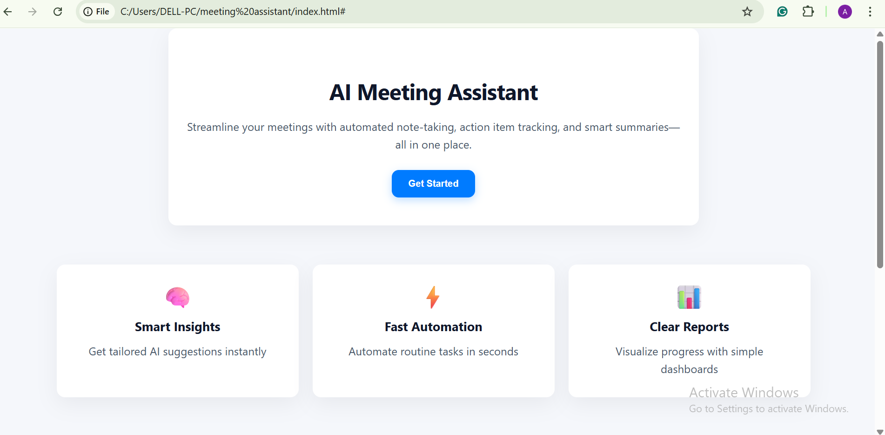
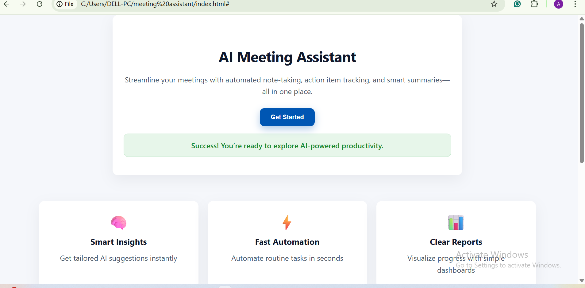

# Meeting Assistant

A simple web application to manage meetings efficiently. This project demonstrates my ability to build a functional UI and basic meeting management features.

---

## Features

- Add, view, and manage meetings
- User-friendly interface
- Organized layout for easy navigation

---

## Screenshots

### Layout


### UI


---

## Technologies Used

- HTML
- CSS
- JavaScript

---

## How to Run

1. Clone the repository:  
```bash
git clone https://github.com/Barnabas29/meeting-assistant.git
